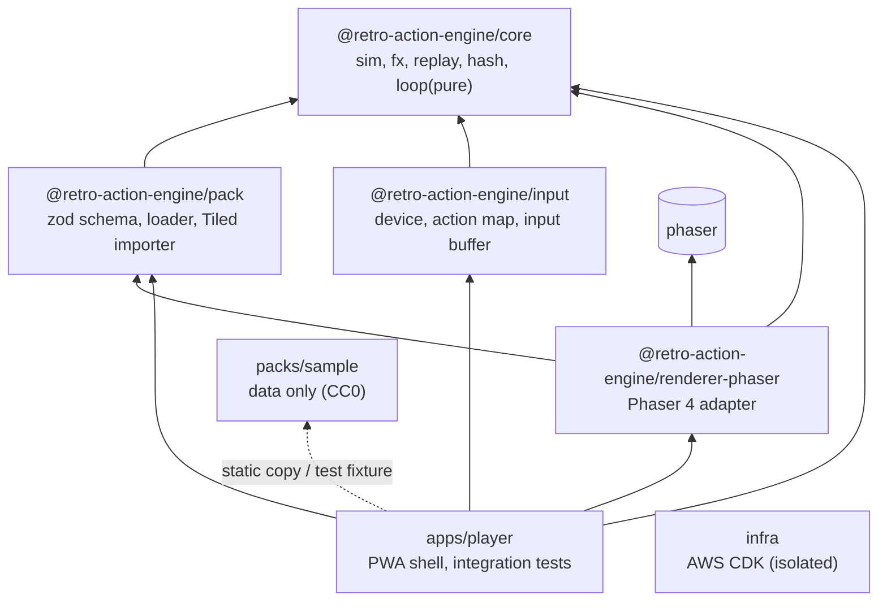
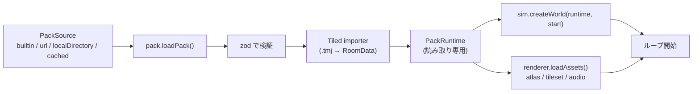
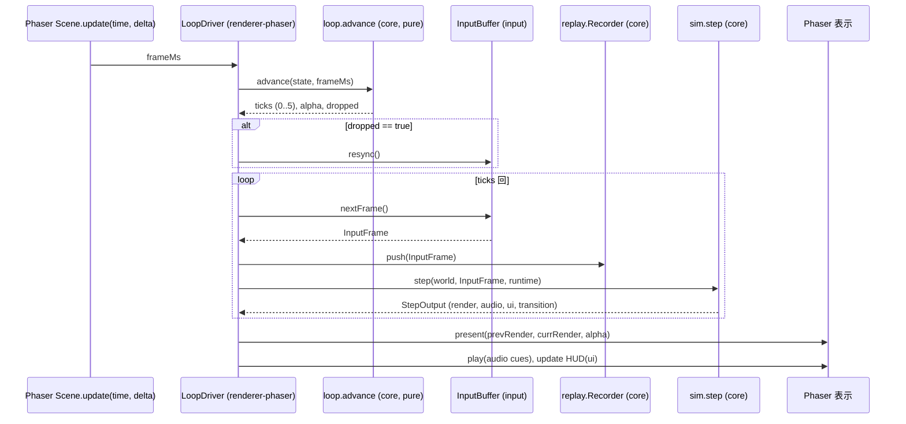

# アーキテクチャ

- 版: 設計初版（実装前）
- 更新日: 2026-10-04
- 関連: 判断の経緯は [decisions/](decisions/README.md)、パック仕様は [pack-spec.md](pack-spec.md)、入力と操作感は [input-and-feel.md](input-and-feel.md)、計画は [roadmap.md](roadmap.md)

## 1. 目的

2D サイドビュー探索型アクション（複数の主人公を切り替え、能力やアイテムで行ける範囲が広がり、拠点から複数のダンジョンを探索し、ボスを倒して進む）を、素材とデータを差し替えるだけで再現できる「エンジン + ゲームパック」型のプラットフォームを提供する。

- エンジン: 固有名詞と調整値を持たない汎用のシミュレーション、入力、描画。
- パック: マップ、タイル、スプライト、キャラクター、敵、アイテム、ルール、音、操作感をデータとして定義したもの。リポジトリにはオリジナル素材のサンプルパックのみを置く。私的なパックはリポジトリ外（URL またはローカル）から読み込む。

## 2. 設計原則

| # | 原則 | 根拠 |
| --- | --- | --- |
| 1 | コアは純 TypeScript で描画・DOM 非依存。Phaser は描画アダプタに留める | [ADR-0001](decisions/ADR-0001-core-render-boundary.md) |
| 2 | 座標は 8.8 固定小数点の整数、時間は 60Hz の tick。決定論を全環境で保証する | [ADR-0002](decisions/ADR-0002-fixed-point-determinism.md), [ADR-0003](decisions/ADR-0003-fixed-timestep-interpolation.md) |
| 3 | 入力は tick 単位の `InputFrame` に正規化し、記録と再生ができる | [ADR-0008](decisions/ADR-0008-input-architecture.md) |
| 4 | パッケージ間の依存は一方向の DAG。逆方向の import は CI で失敗させる | [ADR-0013](decisions/ADR-0013-monorepo-tooling.md) |
| 5 | エンジンに固有名詞・調整値を書かない。すべてパックから供給する | [ADR-0006](decisions/ADR-0006-pack-format-and-schema.md) |
| 6 | テストは「実行同士の比較」と「結果アサーション」を主軸にし、保存 hash の golden は少数に絞る | [ADR-0012](decisions/ADR-0012-test-strategy.md) |

## 3. パッケージ構成と依存方向

初期パッケージは 6 つと、エンジンから独立した `infra` の計 7 つ。リプレイ機能は `core` に含める。`pack-cli` は M4 で `pack` から分離する。



| パッケージ | 依存してよいもの | 依存してはいけないもの | 責務 |
| --- | --- | --- | --- |
| `core` | なし（外部ライブラリも原則なし） | DOM、`phaser`、`pack`、`input` | シミュレーション全体。`Fx`、`World`、衝突、キャラ制御、パーティ、振る舞い、イベント、カメラ、リプレイ、hash、ループの純粋部分。tsconfig の `lib` は `["ES2023"]` で DOM 型を含めない |
| `pack` | `core`（型）、`zod` | DOM API への直接依存（I/O は `FetchLike` を注入） | パックファイルの検証、Tiled JSON の取り込み、`PackRuntime` の構築、外部パックの取得 |
| `input` | `core`（`InputFrame`、`ActionId`） | `pack`、`renderer-phaser` | キーボード、ゲームパッド、タッチの各デバイス、Action マップ、InputBuffer（エッジ規則、再同期） |
| `renderer-phaser` | `core`、`pack`（アセット記述型）、`phaser` | `input` | Phaser Scene、ループドライバ、補間描画、タイル描画、音の再生、HUD |
| `apps/player` | 上記すべて | なし | 配線、設定 UI、PWA、`window.__engine` テストフック、サンプルパックを使う統合テスト |
| `packs/sample` | なし（データのみ） | なし | サンプルパック。`apps/player` の `public/packs/sample` にコピーされ、`pack` と `apps/player` のテスト fixture になる |
| `infra` | `aws-cdk-lib`、`constructs` | エンジンの全パッケージ | S3 + CloudFront、OIDC、IAM ロール 2 本 |

`core` のテストはインラインの小さな fixture のみを使う。`packs/sample` を読むテストは `pack` と `apps/player` に置く。

## 4. 実行時のデータフロー

### 4.1 起動



### 4.2 1 フレーム（requestAnimationFrame 1 回）の処理



- `ticks == 0` のフレーム（120Hz 以上の表示で起こる）は `alpha` だけが進み、前回と今回の `RenderSnapshot` の間を補間して描く。
- `dropped == true` はフレーム時間をクランプして時間を捨てたことを意味し、InputBuffer の再同期トリガになる（[input-and-feel.md](input-and-feel.md) のエッジ規則 7）。

### 4.3 1 tick 内のシステム実行順

実行順は決定論の一部であり、固定する。

| 順 | システム | 内容 |
| --- | --- | --- |
| 1 | `inputIntent` | `InputFrame` と操作感プロファイルから操作意図（移動方向、ジャンプ要求、攻撃要求、切替要求）を作る。先行入力はここで過去 N tick を参照する |
| 2 | `party` | 切替要求を `rules.party.switch` に従って処理する。cooldown、接地条件、配置 |
| 3 | `controller` | 操作中キャラクターの状態機械（grounded / airborne / climb / hitstun）と速度の更新 |
| 4 | `behavior` | 敵とギミックの宣言的状態機械（BehaviorSpec）を 1 ステップ進める |
| 5 | `movement` | 全エンティティの移動と衝突解決（X 軸 → Y 軸、サブステップ、能力タグによる通行判定） |
| 6 | `interaction` | hit/hurt の重なり、拾得、ゾーン進入、出口接触 |
| 7 | `events` | トリガから Action 列を実行し、フラグ・所持品・パーティ・spawn を更新 |
| 8 | `camera` | カメラモードに従って位置を更新（screenFlip / scroll） |
| 9 | `timers` | 無敵時間、アニメーションフレーム、cooldown の減算 |
| 10 | `output` | `RenderSnapshot`、`AudioCue[]`、`UiState`、`TransitionRequest` を生成 |

## 5. コアの内部モジュール（`packages/core/src/`）

| モジュール | 内容 |
| --- | --- |
| `fx/` | 8.8 固定小数点の演算、値域チェック、PRNG（xorshift32） |
| `world/` | `World` の型、エンティティ表（コンポーネント表）、`snapshot/restore` |
| `hash/` | `World` の決定論的 hash（FNV-1a を 2 レーン、`[hi, lo]`） |
| `collision/` | タイルクラス、AABB、軸分離スイープ、oneway、slope（M5）、`CollisionContext` |
| `controller/` | キャラクター状態機械、操作感プロファイルの適用 |
| `party/` | 有効タグの計算、切替、HP と所持品のスコープ |
| `behavior/` | BehaviorSpec の評価、Primitive と Condition の実装 |
| `events/` | トリガ、Condition、Action、フラグストア |
| `camera/` | screenFlip と scroll |
| `replay/` | `InputFrame` の記録（RLE）、再生、checkpoint |
| `loop/` | アキュムレータの純粋部分（`advance`）。DOM に触れない |
| `runtime/` | `PackRuntime` の型（`pack` が構築し、`core` が消費する） |

## 6. 境界 API の型スケッチ

実装ではなく契約の下書き。識別子は英語、フィールド名は pack-spec と一致させる。

```ts
// ---- core/fx ----
export type Fx = number; // int32。1 px = 256（8 fractional bits）
export const FX_SHIFT = 8;
export const FX_ONE = 1 << FX_SHIFT;

export interface FxOps {
  fromPx(px: number): Fx;        // px << 8。|px| < 2^23
  toPxFloor(v: Fx): number;      // v >> 8（床関数）
  mul(a: Fx, b: Fx): Fx;         // trunc((a * b) / 256)。|a|, |b| < 2^26
  div(a: Fx, b: Fx): Fx;         // trunc((a * 256) / b)。b != 0
  setChecks(enabled: boolean): void; // テスト時のみ値域 assert を有効化
}

// ---- core/input contract ----
export type ActionId =
  | 'left' | 'right' | 'up' | 'down'
  | 'jump' | 'attack' | 'switch' | 'item'
  | 'pause' | 'menu' | 'confirm' | 'cancel'
  | 'extra1' | 'extra2' | 'extra3' | 'extra4';

export interface InputFrame {
  held: number;     // ActionId のビットマスク（16 bit）
  pressed: number;  // この tick で down エッジを消費した action
  released: number; // この tick で up エッジを消費した action
}

// ---- core/runtime（pack が構築、core が消費） ----
export interface PackRuntime {
  id: string;
  version: string;
  display: { width: number; height: number; hudReserve: { top: number; bottom: number } };
  tileSize: number;
  rooms: Record<string, RoomData>;
  characters: Record<string, CharacterDef>;
  enemies: Record<string, EnemyDef>;
  items: Record<string, ItemDef>;
  gimmicks: Record<string, GimmickDef>;
  rules: RulesDef;
  feel: Record<string, FeelProfile>;
  camera: CameraConfig;
  assets: AssetManifest; // renderer-phaser が読む。core は参照しない
}

export interface RoomData {
  id: string;
  widthTiles: number;
  heightTiles: number;
  collision: Uint16Array;       // tileClassId（row-major）
  tileClasses: TileClass[];
  renderLayers: RenderLayerData[]; // 描画専用。core は中身を解釈しない
  spawns: Record<string, { x: Fx; y: Fx }>;
  entities: EntitySpawn[];
  zones: ZoneDef[];
  exits: ExitDef[];
}

export interface TileClass {
  id: number;
  solid: 'none' | 'full' | 'oneway' | 'slope';
  heights?: number[];        // slope: 列ごとの高さ（px）。tileSize 要素
  ladder?: boolean;
  hazard?: number;           // 接触ダメージ
  requiresAnyTag?: string[]; // いずれかの能力タグが無ければ solid 扱い
}

// ---- core/world ----
export interface World {
  tick: number;
  rng: number;               // xorshift32 の状態
  roomId: string;
  camera: CameraState;
  party: PartyState;         // members, activeIndex, cooldownTicks, perCharacter HP など
  inventory: InventoryState; // scope に応じて shared または characterId ごと
  flags: Record<string, number | boolean>;
  entities: EntityStore;     // id 昇順で走査できるコンポーネント表
  transitionLockTicks: number;
}

// ---- core/sim ----
export interface StartState {
  roomId: string;
  spawnId: string;
  party?: string[];
  seed: number;
  feelProfile: string;
}

export interface Simulation {
  createWorld(runtime: PackRuntime, start: StartState): World;
  step(world: World, input: InputFrame, runtime: PackRuntime): StepOutput; // world を in-place 更新
  enterRoom(world: World, roomId: string, spawnId: string, runtime: PackRuntime): void;
  snapshot(world: World): WorldSnapshot;
  restore(snapshot: WorldSnapshot): World;
  hash(world: World): WorldHash; // [hi, lo]
}

export type WorldHash = readonly [number, number];

export interface StepOutput {
  render: RenderSnapshot;
  audio: AudioCue[];
  ui: UiState;
  transition: TransitionRequest | null;
}

export interface RenderSnapshot {
  tick: number;
  camera: { x: number; y: number }; // px（床関数済み）
  sprites: RenderSprite[];          // id 昇順
}

export interface RenderSprite {
  id: number;
  atlas: string;
  frame: string;
  x: number;        // px
  y: number;        // px
  flipX: boolean;
  depth: number;
  visible: boolean;
}

export interface AudioCue {
  kind: 'sfx' | 'bgm' | 'stopBgm';
  key: string;
}

export interface UiState {
  activeCharacterId: string;
  canSwitch: boolean;           // 1 人構成や mode: 'never' では false
  party: Array<{ id: string; hp: number; hpMax: number; alive: boolean }>;
  inventory: Array<{ itemId: string; count: number }>;
  message: string | null;       // showText の表示要求（キーは strings で解決）
}

export interface TransitionRequest {
  kind: 'room';
  toRoomId: string;
  spawnId: string;
  effect: 'cut' | 'fade' | 'scroll';
  direction?: 'left' | 'right' | 'up' | 'down';
}

// ---- core/loop（純粋） ----
export interface LoopConfig {
  tickRate: 60;          // tick/s
  maxFrameMs: 250;       // これを超えるフレーム時間は切り捨てる
  maxTicksPerFrame: 5;   // これを超える分の時間は捨てる
}

export interface LoopState {
  accUnits: number;      // ms * tickRate の単位。1 tick = 1000 units
}

export interface AdvanceResult {
  ticks: number;         // このフレームで消化する tick 数
  alpha: number;         // 0..1。補間係数
  dropped: boolean;      // 時間を捨てた（再同期トリガ）
}

export function advance(state: LoopState, frameMs: number, cfg: LoopConfig): AdvanceResult;
```

## 7. 描画アダプタ（`renderer-phaser`）

### 7.1 責務

- Phaser の `Game` と `Scene` を生成し、`scene.update(time, delta)` からループドライバを呼ぶ。
- `RenderSnapshot` を prev/curr の 2 世代保持し、`alpha` で線形補間して Sprite の位置とカメラの scroll を設定する。操作感プロファイルの `interpolation: 'none'` では curr をそのまま使う。
- `RoomData.renderLayers` から `make.tilemap({ data })` で Tilemap を作り、`createLayer` で描く。1 タイルセットのレイヤは `gpu: true`（`TilemapGPULayer`）を選べる。
- `AudioCue` を Phaser の Sound で再生する。iOS の解錠（`sound.unlock()`、`Sound.Events.UNLOCKED`）を扱う。
- HUD はプレイ領域外（`hudReserve`）に `scrollFactor 0` のレイヤで描く。カメラの viewport は `setViewport(0, hudReserve.top, width, height - top - bottom)`。
- アセットの取得: URL パックは `load.setBaseURL` と `load.atlas/image/audio`、ローカルディレクトリパックは Blob から `textures.addAtlas` / `textures.addImage` / `sound.decodeAudio` で登録する。

### 7.2 使用する Phaser 4 API（`node_modules/phaser/types/phaser.d.ts` で確認済み）

| 用途 | API | 備考 |
| --- | --- | --- |
| Game 設定 | `Phaser.Types.Core.GameConfig`: `type: Phaser.WEBGL`, `pixelArt: true`, `antialias: false`, `roundPixels: true`, `fps: { smoothStep: false }`, `input: { keyboard: false, gamepad: false }`, `scale`, `audio` | Canvas レンダラは v4 で非推奨。キーボードとゲームパッドは自前の入力層で扱うため Phaser 側を無効化 |
| ループ | `Scene.update(time, delta)` | Phaser の `TimeStep` は RAF 1 回に 1 回呼ぶだけ。固定ステップは自前のアキュムレータで行う |
| タイル描画 | `scene.make.tilemap({ data, tileWidth, tileHeight })`, `Tilemap.addTilesetImage`, `Tilemap.createLayer(0, tileset, 0, 0, gpu)`, `TilemapGPULayer.generateLayerDataTexture()` | GPU レイヤは直交マップと 1 タイルセットのみ。タイル編集後は再生成が必要 |
| スプライト | `scene.add.sprite`, `setTexture`, `setFrame`, `setFlipX`, `setPosition`, `setDepth`, `setVisible`, `vertexRoundMode` | Phaser の Animation は使わず、コアのフレーム状態をそのまま設定する |
| カメラ | `Camera.setScroll`, `setRoundPixels`, `setViewport`, `fadeIn/fadeOut` | 境界クランプはコアが行うため `setBounds` は使わない |
| 音 | `WebAudioSoundManager.unlock()`, `locked`, `Sound.Events.UNLOCKED`, `sound.add(key, { loop })`, `sound.decodeAudio(key, arrayBuffer)`, `sound.context` | `SoundConfig` に `loopStart/loopEnd` は無い。ループ点付き BGM が必要なら `sound.context` を共有する自前の `AudioBufferSourceNode` で再生する（要確認: サンプルパックで必要か） |
| ローダ | `load.setBaseURL`, `load.setCORS`, `load.atlas`, `load.image`, `load.audio`, `textures.addAtlas`, `textures.addImage`, `textures.addSpriteSheet` | 外部パックは CORS が必要 |
| スケール | `Scale.FIT`, `ScaleManager.getMaxZoom()`, `setZoom()`, `startFullscreen()`, `lockOrientation()`, `Scale.Events.FULLSCREEN_UNSUPPORTED`, `ORIENTATION_CHANGE` | 整数倍スケール優先、入らなければ FIT |

Phaser 4 の変更点（Pipeline→RenderNode、FX→Filters、`roundPixels` 既定 false、Camera 行列の再設計）は `node_modules/phaser/changelog/v4/4.0/MIGRATION-GUIDE.md` と `node_modules/phaser/skills/` に一次情報がある。

## 8. 入力層とアプリ層

- `input` は DOM と Gamepad API を扱い、`InputFrame` を tick 直前に生成する。詳細は [input-and-feel.md](input-and-feel.md)。
- `apps/player` は配線のみを持つ: パックの選択、設定 UI（DOM）、PWA 登録、`window.__engine`（`runReplay(file)` と `hash()` を公開するテストフック）。
- メニューやキーコンフィグも Action 語彙（`confirm` / `cancel` / `menu`）で操作し、Phaser の Input には依存しない。

## 9. ディレクトリ構成（計画）

```
retro-action-engine/
├─ apps/player/              # PWA シェル、統合テスト、Playwright
├─ packages/core/            # 純 TS シミュレーション
├─ packages/pack/            # スキーマ、ローダ、Tiled importer（M4 で pack-cli を分離）
├─ packages/input/           # デバイス、Action マップ、InputBuffer
├─ packages/renderer-phaser/ # Phaser 4 アダプタ
├─ packs/sample/             # サンプルパック（データのみ、CC0）
├─ infra/                    # AWS CDK（S3 + CloudFront + OIDC + IAM）
├─ schemas/                  # zod から生成した JSON Schema（M4）
├─ docs/                     # 本書、ADR、仕様
├─ .github/workflows/        # ci.yml, preview.yml, deploy.yml
├─ pnpm-workspace.yaml / package.json / biome.json / tsconfig.base.json
├─ .dependency-cruiser.cjs / .nvmrc
└─ CLAUDE.md
```

## 10. 非目標（v1）

- オンライン対戦、同期マルチプレイ。
- 剛体物理（Matter 等）を使う物理パズル。
- 外部パックに含まれるコードの実行（[ADR-0005](decisions/ADR-0005-entity-model-and-pack-code.md) で Deferred）。
- クラウドセーブ。
- 専用のマップエディタ GUI（Tiled を使う）。

## 11. 用語集

| 用語 | 意味 |
| --- | --- |
| tick | シミュレーションの 1 ステップ。60Hz 固定 |
| フレーム | ブラウザの描画 1 回（RAF 1 回）。tick とは独立 |
| Fx | 8.8 固定小数点の整数値。1 px = 256 |
| InputFrame | 1 tick 分の入力。`held / pressed / released` のビットマスク |
| 操作感プロファイル（FeelProfile） | ジャンプ軌道、空中制御、猶予フレームなどのパラメータ集合。パックが複数定義し、切り替えられる |
| 能力タグ | `move:swim` のような文字列。通行判定とゲートの条件に使う。キャラクター ID は使わない |
| PackRuntime | 検証・変換済みの読み取り専用パックデータ |
| World | 可変のシミュレーション状態 |
| RenderSnapshot | 1 tick 分の描画指示。描画層が補間して表示する |
| screenFlip / scroll | カメラの 2 モード。画面切替型とスクロール型 |
| hudReserve | 表示解像度のうち HUD に確保する上下の帯。残りがプレイ領域 |
