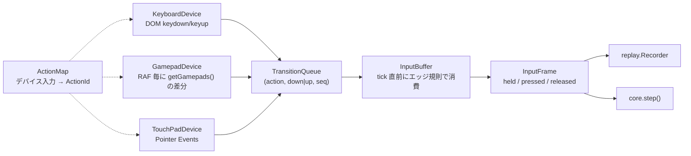

# 入力層と操作感プロファイル

- 版: 設計初版
- 更新日: 2026-10-04
- 根拠: [ADR-0008](decisions/ADR-0008-input-architecture.md)、[ADR-0003](decisions/ADR-0003-fixed-timestep-interpolation.md)、[ADR-0002](decisions/ADR-0002-fixed-point-determinism.md)

## 1. 目標

- キーボード、ゲームパッド、タッチ（仮想パッド）で同じ操作ができ、キーコンフィグできる。
- 入力は tick 単位の `InputFrame` に正規化され、どのデバイス・どのフレームレートでも同じ列になる。
- `InputFrame` の列を記録・再生すれば、画面のない環境で同じ結果が得られる。
- 原作風の固い操作と現代的な操作を、操作感プロファイルの切替だけで行き来できる。

## 2. 層構成



| 層 | パッケージ | 責務 | 決定論の対象 |
| --- | --- | --- | --- |
| Device | `input` | DOM / Gamepad API からの状態遷移をキューに積む | 外 |
| ActionMap | `input` | デバイス入力を `ActionId` に写像。バインドの保存と上書き | 外 |
| InputBuffer | `input`（規則の純粋部分は `core` にも置き、テストする） | tick 直前に `InputFrame` を生成。エッジ規則と再同期 | 外（出力の `InputFrame` から先が対象） |
| Simulation | `core` | `InputFrame` を消費。先行入力、コヨーテタイム、SOCD | 内 |

## 3. Device 層

### 3.1 KeyboardDevice

- `window` の `keydown` / `keyup` を監視し、`KeyboardEvent.code` でバインドを引く。`repeat === true` は無視する。
- バインド済みのキーだけ `preventDefault()`（ブラウザのスクロールやスペースの既定動作を抑止）。未バインドのキーは素通し。
- IME 合成中（`isComposing`）は無視する。
- `blur` と `visibilitychange(hidden)` で再同期トリガ (d)（全 action 解放）。

### 3.2 GamepadDevice

- RAF 毎（ループドライバのフレーム先頭、tick 消化の前）に `navigator.getGamepads()` を読み、前回のスナップショットとの差分を遷移としてキューに積む。120Hz の表示では 1 tick に 2 回ポーリングされ、短いタップも差分として残る。
- `mapping === "standard"` のパッドは `input.json` の `gamepad.standard` を使う（M1）。非標準は M2 の割当 UI で `gamepad.<id>` を作るまで未割当。
- 複数パッド: 最後に入力があったパッドを「アクティブ」とし、他は無視する（設定で固定も可）。
- 接続・切断は `gamepadconnected` / `gamepaddisconnected` で検知し、切断時はそのパッド由来の held をすべて up にする。
- アナログ軸のデジタル化: 軸値の絶対値が `deadzone`（既定 0.35）以上で down、`release`（既定 0.25）以下で up（ヒステリシス）。方向は符号。左スティックのみ方向に使う。
- 振動は `gamepad.vibrationActuator` があれば任意で使う（設定で切替）。

### 3.3 TouchPadDevice（M2）

- DOM オーバーレイ（`<div>`）に Pointer Events で実装する。`touch-action: none`、`user-select: none`。
- 押下・解放は Pointer イベント発生時に即座にキューへ積む（RAF を待たない）。
- 仕様の詳細は 9 章。

### 3.4 Phaser の入力との関係

- Phaser の `input.keyboard` と `input.gamepad` は無効化する（`GameConfig.input: { keyboard: false, gamepad: false }`）。Phaser は PRE_STEP で入力を更新するため、tick 直前のサンプリングを保証できず、エッジ規則も適用できない。
- メニューも Action 語彙（`confirm` / `cancel` / `menu` / 方向）で操作する。設定画面は DOM。

## 4. ActionMap

### 4.1 Action 語彙（エンジン固定）

| ActionId | 意味 | 備考 |
| --- | --- | --- |
| `left` / `right` | 水平移動 | 同時押しは 6.3 の SOCD 規則 |
| `up` / `down` | 梯子、しゃがみ、ドアに入る、メニュー移動 | `interact.action: "up"` のパックでは `up` が調べる |
| `jump` | ジャンプ | `down + jump` ですり抜け床を降りる |
| `attack` | 攻撃 | |
| `switch` | キャラクター切替 | 1 人構成では無効 |
| `item` | アイテム使用 | |
| `pause` | ポーズ | |
| `menu` | メニュー開閉 | |
| `confirm` / `cancel` | メニュー決定 / 戻る | ゲーム中は `interact.action: "confirm"` のパックで調べる |
| `extra1` 〜 `extra4` | パックが自由に使う | 振る舞いや Action から `inputHeld('extra1')` で参照 |

ビット位置は上表の順に 0 から 15。`InputFrame` の各フィールドは 16 bit のビットマスク。

### 4.2 バインドの形式と優先順位

- 既定: パックの `input.json`。
- ユーザ上書き: `Settings.bindings`（グローバル）→ `Settings.perPack[packId].bindings`。後者が優先。
- 1 つの物理入力を複数の Action に割り当ててよい（例: `KeyZ` を `jump` と `confirm`）。1 つの Action に複数の物理入力を割り当ててもよい。
- 競合は許容し、UI では警告だけ出す。

### 4.3 キーコンフィグ UI（M2）

1. 一覧から Action を選ぶ。
2. 「押してください」状態になり、次に来たデバイス入力（キー、ボタン、軸の方向）をその Action に追加する。`Escape` と `cancel` は中断。
3. 既存の割当は個別に削除できる。「既定に戻す」でパック既定へ。
4. 保存は即時（`Settings`）。

## 5. InputBuffer と `InputFrame`

```ts
interface InputFrame {
  held: number;     // tick 終了時点で押されている action
  pressed: number;  // この tick で down エッジを消費した action
  released: number; // この tick で up エッジを消費した action
}

interface Transition { action: ActionId; kind: 'down' | 'up'; seq: number }
```

### 5.1 エッジ規則

1. Device 層は状態遷移 `(action, down | up, seq)` を発生順にキューへ積む。
2. tick 直前に InputBuffer がキューを先頭から消費する。同一 action の遷移は 1 tick に最大 1 つ。2 つ目に当たった時点で消費を止め、以降は次 tick に持ち越す（全体の順序を保つ）。
3. `held(t)` = 消費後の状態。`pressed(t)` = down を消費した action。`released(t)` = up を消費した action。同一 action の pressed と released が同じ tick に立つことはない。すべてのエッジはちょうど 1 回ずつ、発生順に届く。
4. tick より短いタップは「tick t で pressed + held、tick t+1 で released」になる。最短 1 tick の押下を保証する。
5. 1 フレームで k tick を消化する場合も tick ごとに 2 を適用する。遷移が尽きた tick は `held = 現在状態, pressed = released = 0`。エッジは複製されない。
6. 1 tick の間に複数回ポーリングされても差分がキューに積まれるのでタップは失われない。
7. 再同期（5.2）。
8. リプレイは規則適用後の `InputFrame` を記録する。

例 1: 1 フレームで 2 tick、キュー = `jump↓, jump↑, jump↓`

| tick | 消費 | held | pressed | released |
| --- | --- | --- | --- | --- |
| t | `jump↓`（次の `jump↑` は 2 つ目なので停止） | jump | jump | — |
| t+1 | `jump↑`（次の `jump↓` は 2 つ目なので停止） | — | — | jump |
| t+2（次フレーム） | `jump↓` | jump | jump | — |

例 2: 異なる action は同じ tick に消費できる。キュー = `right↓, jump↓, right↑`

| tick | 消費 | held | pressed | released |
| --- | --- | --- | --- | --- |
| t | `right↓`, `jump↓`（`right↑` は right の 2 つ目なので停止） | right, jump | right, jump | — |
| t+1 | `right↑` | jump | — | right |

例 3: 順序の保持。キュー = `jump↓, jump↑, attack↓`

| tick | 消費 | 備考 |
| --- | --- | --- |
| t | `jump↓` のみ | `jump↑` で停止するため、その後ろの `attack↓` も次 tick へ（順序を崩して先に消費しない） |
| t+1 | `jump↑`, `attack↓` | |

### 5.2 再同期（resync）

次のいずれかでキューを全破棄し、物理状態へ再同期する。最古の遷移だけを捨てることはしない（古い down だけが残って「押しっぱなし」になる事故を防ぐ）。

| トリガ | 条件 | 既定値 |
| --- | --- | --- |
| (a) キューあふれ | キュー長が上限を超えた | 256 件 |
| (b) バックログ超過 | バックログ深さ > `maxBacklogTicks`。バックログ深さ = ある action の未消費遷移数の最大値（1 tick に 1 つしか消費しないため、消化に必要な tick 数と等しい） | 6 tick（約 100ms）、設定可 |
| (c) 時間の切り捨て | ループドライバがフレーム時間をクランプした（`AdvanceResult.dropped`） | 250ms / 5 tick |
| (d) フォーカス喪失 | `blur`、`visibilitychange(hidden)`、パッドの切断 | 物理状態は「全 action 解放」とみなす |

手順:
1. キューを空にする。
2. 各 action について、「最後に発行した `InputFrame` の held」と「現在の物理状態」（キーボードは DOM 由来の押下集合、ゲームパッドは直近ポーリング、タッチはアクティブポインタ）を比較する。
3. 異なる action にだけ遷移を 1 つ積む（物理が押下なら down、解放なら up）。
4. 次の tick でエッジは action あたり最大 1 つ、held は 1 tick 後に現実と一致する。
5. `resyncCount` を計上し、開発ビルドでは警告を出す。

再同期はライブ入力の生成にのみ影響する。記録済みの `InputFrame` 列の再生には関与しない。

### 5.3 1 フレームの処理順

1. ループドライバがフレーム時間から `ticks`、`alpha`、`dropped` を得る（ADR-0003）。
2. `GamepadDevice.poll()`（差分をキューへ）。
3. `dropped` なら `InputBuffer.resync()`。
4. `ticks` 回: `InputBuffer.nextFrame()` → `Recorder.push()` → `sim.step()`。
5. 描画（補間）。

## 6. シミュレーション側の入力処理

### 6.1 操作意図（`inputIntent` システム）

`InputFrame` と操作感プロファイルから次を作る: `moveDir ∈ {-1, 0, +1}`、`jumpRequested`、`jumpHeld`、`attackRequested`、`switchRequested`、`dropThroughRequested`、`climbDir`。

### 6.2 先行入力とコヨーテタイム

- ジャンプバッファ: `jump` の pressed から `jumpBufferTicks` 以内に接地したら、接地した tick にジャンプする。実装は「最後に `jump` が pressed になった tick」を `World` に保存して比較する。
- コヨーテタイム: 接地を失ってから `coyoteTicks` 以内の `jump` pressed はジャンプできる。実装は「最後に接地していた tick」を保存して比較する。ジャンプで離陸した場合は無効。
- どちらも `InputFrame` の履歴から導けるため、デバイス層には持たせない。

### 6.3 SOCD（左右同時押し）

`feel.socd` で選ぶ。`neutral`（両方押しで停止、原作風の多く）/ `lastWins`（後に押した方。pressed の tick を記録して判定）/ `leftWins`。上下は `neutral` 固定。

### 6.4 すり抜け床の降下

`down` を held の状態で `jump` が pressed になったら、ジャンプせず `dropThroughTicks` の間 oneway を無視する。

### 6.5 切替

`switch` pressed で `rules.party.switch` に従って切替要求。cooldown 中、`requireGrounded` 未達、`mode: 'never'`、1 人構成では無視する。

## 7. ループ連携

- アキュムレータは `ms × 60` 単位（1 tick = 1000 units）。`frameMs` を 250ms でクランプ、1 フレーム最大 5 tick。超過分は捨てて `dropped = true`。
- `alpha = accUnits / 1000`。描画層は prev/curr の `RenderSnapshot` を補間する。`interpolation: 'none'` のプロファイルでは curr をそのまま使う。
- `ticks == 0` のフレームでは入力を消費せず、描画だけ更新する。

## 8. 操作感プロファイル（`feel.json`）

### 8.1 構造

```ts
interface FeelProfile extends FeelMotion {
  id: string;
  name: string;
  interpolation: 'linear' | 'none';
  socd: 'neutral' | 'lastWins' | 'leftWins';
}

interface FeelMotion {
  // 走行
  runSpeed: number;              // px/tick
  groundAccel: number;           // px/tick²。runSpeed 以上なら即時加速
  groundDecel: number;           // px/tick²。runSpeed 以上なら即時停止
  turnDecel: number;             // px/tick²。反転時の減速。0 で groundDecel と同じ
  airAccel: number;              // px/tick²
  airDecel: number;              // px/tick²
  airControl: number;            // 0..1。空中の加速の係数。0 で空中制御なし
  // ジャンプと重力
  jumpVelocity: number;          // px/tick（上向き正）
  gravity: number;               // px/tick²
  fallGravityScale: number;      // 下降中の重力倍率。1 で対称
  maxFallSpeed: number;          // px/tick
  jumpCutScale: number;          // ボタンを離したときの上昇速度の倍率。1 で可変ジャンプなし（固定高さ）
  minJumpTicks: number;          // この tick 数までは jumpCut を適用しない
  apexGravityScale: number;      // |vy| < apexThreshold のときの重力倍率。1 で無効
  apexThreshold: number;         // px/tick
  coyoteTicks: number;
  jumpBufferTicks: number;
  dropThroughTicks: number;
  landingLagTicks: number;       // 着地硬直。0 で無し
  // 被弾
  knockback: { x: number; y: number }; // px/tick
  hitstunTicks: number;
  invincibleTicks: number;
  // 坂と梯子（M5）
  slopeSnapPx: number;
  climbSpeed: number;            // px/tick
}
```

キャラクターの `feelOverrides` は `FeelMotion` の一部を上書きする（`effective = { ...profile, ...character.feelOverrides }`）。プロファイルの切替はゲーム中いつでも可能で、次の tick から効く。

### 8.2 パラメータ一覧と例値

| パラメータ | 単位 | retro（原作風） | modern（現代的） | 説明 |
| --- | --- | --- | --- | --- |
| `runSpeed` | px/tick | 1.5 | 1.5 | 最高速 |
| `groundAccel` | px/tick² | 1.5（即時） | 0.25 | 0 から最高速までの加速 |
| `groundDecel` | px/tick² | 1.5（即時） | 0.3 | 入力なしの減速 |
| `turnDecel` | px/tick² | 0 | 0.5 | 反転時の減速 |
| `airAccel` | px/tick² | 0 | 0.2 | |
| `airDecel` | px/tick² | 0 | 0.05 | |
| `airControl` | 0..1 | 0 | 1 | 0 で離陸時の速度のまま |
| `jumpVelocity` | px/tick | 4.5 | 4.0 | |
| `gravity` | px/tick² | 0.25 | 0.21 | |
| `fallGravityScale` | 倍 | 1 | 1.5 | |
| `maxFallSpeed` | px/tick | 4.0 | 5.0 | |
| `jumpCutScale` | 倍 | 1（固定高さ） | 0.4 | |
| `minJumpTicks` | tick | 0 | 4 | |
| `apexGravityScale` | 倍 | 1 | 0.6 | |
| `apexThreshold` | px/tick | 0 | 0.5 | |
| `coyoteTicks` | tick | 0 | 6 | |
| `jumpBufferTicks` | tick | 0 | 6 | |
| `dropThroughTicks` | tick | 8 | 8 | |
| `landingLagTicks` | tick | 0 | 0 | |
| `knockback` | px/tick | {x: 1.5, y: 2.5} | {x: 1.0, y: 2.0} | |
| `hitstunTicks` | tick | 20 | 12 | |
| `invincibleTicks` | tick | 60 | 60 | |
| `interpolation` | — | none | linear | |
| `socd` | — | neutral | lastWins | |
| `slopeSnapPx`（M5） | px | 4 | 4 | |
| `climbSpeed`（M5） | px/tick | 1.0 | 1.0 | |

例値はサンプルパックの出発点であり、調整して構わない。Feel scenario テストは固定値ではなくプロファイルから期待値を導出する。

### 8.3 導出式（テストの期待値に使う）

固定小数点の tick 積分（速度を先に更新し、位置に加える）で:

- 上昇 tick 数 `T = ceil(jumpVelocity / gravity)`。
- 最高到達高さ `H = Σ_{k=1..T} max(0, jumpVelocity − k·gravity)`（Fx の trunc を含めて同じ式で計算する）。
- retro 例: `jumpVelocity 4.5`, `gravity 0.25` → `T = 18`、`H ≈ 38.25 px`（約 2.4 タイル）。
- 水平到達距離（空中制御なし）: `runSpeed × 滞空 tick 数`。

テストは「`H − 1 ≤ 実測 ≤ H + 1`」のように ±1 px の許容幅で検証する。

### 8.4 キャラクター状態機械（概要）

| 状態 | 遷移先 | 条件 |
| --- | --- | --- |
| `grounded` | `airborne` | ジャンプ、足場を失う（コヨーテ開始） |
| `grounded` | `climb` | 梯子タイル上で `up/down`（M5） |
| `airborne` | `grounded` | 下向き衝突（`landingLagTicks` を開始） |
| `airborne` | `climb` | 梯子タイル上で `up`（M5） |
| 任意 | `hitstun` | 被弾（無敵中は除く） |
| `hitstun` | `airborne` / `grounded` | `hitstunTicks` 経過 |
| 任意 | `dead` | HP 0 |

攻撃は状態ではなくフラグ（`attacking`、残り tick）とし、空中でも出せる。

## 9. 仮想パッド（M2）

### 9.1 レイアウト

```ts
interface TouchLayout {
  id: string;
  handedness: 'right' | 'left';           // 左右入替
  opacity: number;                         // 0..1
  dpad: { cx: number; cy: number; radius: number; deadzoneRatio: number; floating: boolean };
  buttons: Array<{ action: ActionId; cx: number; cy: number; radius: number; label: string }>;
}
// cx, cy はセーフエリア内の相対座標（0..1）。radius は短辺に対する比率
```

- 既定レイアウト（`handedness: 'right'`）: 左下に D-pad、右下に `jump` と `attack` を横並び、その上に `switch` と `item`、上端中央に `pause`。
- ユーザは設定画面で位置と大きさをドラッグで変え、`Settings.touchLayout` に保存する。

### 9.2 D-pad

- 中心からの距離が `radius × deadzoneRatio` 未満なら無入力。
- 8 方向。角度で判定し、方向の境界にヒステリシス（±10°）を持たせて境界付近のばたつきを防ぐ。
- `floating: true` のときは最初に触れた位置を中心にする。
- 指をスライドさせたまま方向が変わるのを許す。

### 9.3 ボタン

- マルチタッチ対応。ボタン間をスライドしたら、離れたボタンは up、入ったボタンは down。
- 押下領域は見た目より 1.2 倍広くする。

### 9.4 表示条件とその他

- `matchMedia('(pointer: coarse)')` が真でゲームパッド未接続なら表示。設定で常時表示 / 非表示を選べる。
- 触覚フィードバックは `navigator.vibrate(10)` を任意で（Android のみ有効）。
- 仮想パッドは DOM であり、キャンバスの外（セーフエリア内）に置く。`env(safe-area-inset-*)` を使う。

## 10. 遅延対策チェックリスト

| 項目 | 対応 |
| --- | --- |
| ループ | RAF 固定。`setTimeout` ループと `fps.limit` は使わない |
| サンプリング | tick 直前。ゲームパッドはフレーム先頭でポーリング |
| 描画 | tick 消化と同じフレームで描く。補間の遅延は最大 1 tick、`none` なら 0 |
| Phaser | `fps.smoothStep: false`、`input.keyboard/gamepad: false` |
| キーボード | `repeat` 無視、`isComposing` 無視、必要なキーのみ `preventDefault` |
| キャンバス | `desynchronized: true` は M2 で実測して判断 |
| 計測 | 開発ビルドで「入力イベント時刻 → その入力を含む tick の描画時刻」をオーバーレイ表示 |

## 11. リプレイ

### 11.1 形式

```ts
interface ReplayFile {
  version: 1;
  packId: string;
  packVersion: string;
  feelProfile: string;
  seed: number;
  start: { roomId: string; spawnId: string; party?: string[] };
  frames: Array<[count: number, held: number, pressed: number, released: number]>; // 同一フレームの連続を count でまとめる
  checkpoints?: Array<{ tick: number; hash: [number, number] }>;
  final?: { tick: number; hash: [number, number] };
}
```

- `Recorder.push(frame)` は直前と同じなら `count` を増やす。pressed / released が非ゼロのフレームは原理的に連続しないので、RLE は held だけの区間を圧縮する。
- `Player` は `frames` を展開して tick ごとに `InputFrame` を返す。終端後は `held = 0` を返す。
- `checkpoints` は任意。Determinism テストでは実行同士の tick 毎 hash を比較するため、ファイル内の hash は参考情報。Golden テストだけが `final.hash` を使う。

### 11.2 使い方

- 記録: 開発ビルドのメニュー、または `window.__engine.startRecording()` / `stopRecording(): ReplayFile`。
- 再生: `window.__engine.runReplay(file, { until?: tick }): Promise<{ tick, hash, checkpoints }>`。描画ありで再生し、Node 側と同じ hash を返す。
- Node: `runReplayHeadless(file, runtime)`（`core`）。
- Feel scenario は `ReplayFile` ではなく合成 DSL で `InputFrame` 列を作る: `script().hold('right', 30).tap('jump', { at: 10 }).build()`。

## 12. テストフック（`window.__engine`）

| メソッド | 用途 |
| --- | --- |
| `hash()` | 現在の `World` の hash |
| `runReplay(file, opts)` | リプレイ実行と hash 取得（Determinism (c)） |
| `getStats()` | `resyncCount`、`droppedFrames`、tick 数 |
| `setFeelProfile(id)` | プロファイル切替 |
| `loadPack(source)` | パック切替 |

本番ビルドでは `window.__engine` を公開しない（Vite の `import.meta.env.DEV` と e2e 用フラグで制御）。
